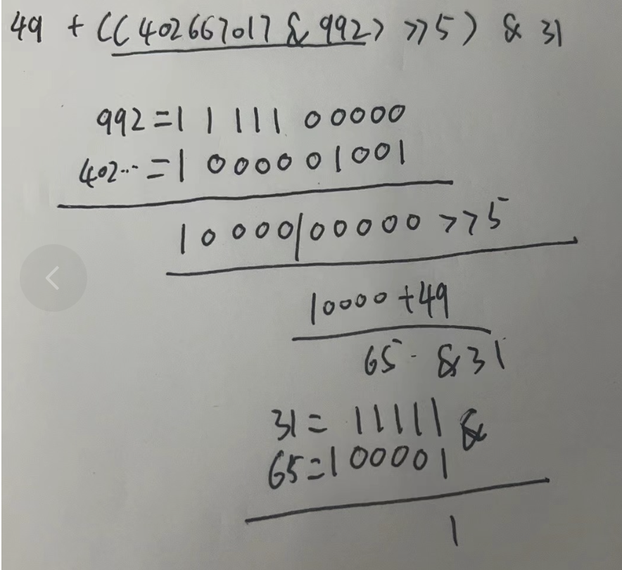

## Integer类的继承关系

```java
public final class Integer extends Number implements Comparable<Integer>
```

Integer类继承自Number的一个抽象类，和实现了Comparable接口。

## 成员变量

```java
/**
     * A constant holding the minimum value an {@code int} can
     * have, -2<sup>31</sup>.
     */
    @Native public static final int   MIN_VALUE = 0x80000000;

    /**
     * A constant holding the maximum value an {@code int} can
     * have, 2<sup>31</sup>-1.
     */
    @Native public static final int   MAX_VALUE = 0x7fffffff;

    /**
     * The {@code Class} instance representing the primitive type
     * {@code int}.
     *
     * @since   JDK1.1
     */
    @SuppressWarnings("unchecked")
    public static final Class<Integer>  TYPE = (Class<Integer>) Class.getPrimitiveClass("int");

    /**
     * All possible chars for representing a number as a String
     */
    final static char[] digits = {
        '0' , '1' , '2' , '3' , '4' , '5' ,
        '6' , '7' , '8' , '9' , 'a' , 'b' ,
        'c' , 'd' , 'e' , 'f' , 'g' , 'h' ,
        'i' , 'j' , 'k' , 'l' , 'm' , 'n' ,
        'o' , 'p' , 'q' , 'r' , 's' , 't' ,
        'u' , 'v' , 'w' , 'x' , 'y' , 'z'
    };
```

- MIN_VALUE 最小值 -2<sup>31</sup>

- MAX_VALUE 最大值 2<sup>31</sup>-1.

- TYPE 表示他的基本数据类型是int

- digits 现在解释起来有点复杂，后面用到的时候在看

## 常用方法

### parseInt 方法

```java
public static int parseInt(String s) throws NumberFormatException {
    return parseInt(s,10);
}
```

我们常用的ParseInt方法后面又会调用一次方法，parseInt(s, 10)方法，具体要进去看这个实现了。

```java
public static int parseInt(String s, int radix)
```

看方法入参，radix属性当前为10，大概率是十进制的意思，继续看后续代码。

```java
if (s == null) {
    throw new NumberFormatException("null");
}
if (radix < Character.MIN_RADIX) {
    throw new NumberFormatException("radix " + radix +
                                    " less than Character.MIN_RADIX");
}
if (radix > Character.MAX_RADIX) {
    throw new NumberFormatException("radix " + radix +
                                    " greater than Character.MAX_RADIX");
}
```

这里判断null值，和判断一下radix是否合法，大于等于2，小于等于36.

```java
int result = 0;
boolean negative = false;
int i = 0, len = s.length();
int limit = -Integer.MAX_VALUE;
int multmin;
int digit;
```

后面声明了几个变量，分别解读下目前已知含义的。

> result 大概率是最后的结果值
> 
> negative 看意思是用来标记是否为负数
> 
> len 是s的长度
> 
> i 是用来遍历字符串的
> 
> 其余的暂时不知道，后面看到在解释

```java
if (len > 0) {
    // ...
} else {
    throw NumberFormatException.forInputString(s);
}
return negative ? result : -result;
```

看后面的代码得知，猜测基本正确，根据negative判断是正负数，随后返回result变量。

后面进入If中看一下吧。

```java
char firstChar = s.charAt(0);
if (firstChar < '0') { // Possible leading "+" or "-"
    if (firstChar == '-') {
        negative = true;
        limit = Integer.MIN_VALUE;
    } else if (firstChar != '+')
        throw NumberFormatException.forInputString(s);
    if (len == 1) // Cannot have lone "+" or "-"
        throw NumberFormatException.forInputString(s);
    i++;
}
multmin = limit / radix;
```

获取了第一个字符，然后和0进行比较，按照ascii码对比，小于'0'字符的都是特殊字符。

这里主要的操作就是，处理了负数符号。

```java
while (i < len) {
    // Accumulating negatively avoids surprises near MAX_VALUE
    digit = Character.digit(s.charAt(i++),radix);
    if (digit < 0) {
        throw NumberFormatException.forInputString(s);
    }
    if (result < multmin) {
        throw NumberFormatException.forInputString(s);
    }
    result *= radix;
    if (result < limit + digit) {
        throw NumberFormatException.forInputString(s);
    }
    result -= digit;
}
```

这里的while是用来遍历我们传入的字符串，方法一进入，调用了Character类的digit方法，随后一个*=radix也就是是10，然后result刚刚计算的值-=digit。所以这里要去看一下digit到底是什么。

```java
public static int digit(char ch, int radix) {
    return digit((int)ch, radix);
}
```

这里把ch变为了int，也就是ascii码对应的int。

```java
public static int digit(int codePoint, int radix) {
    return CharacterData.of(codePoint).digit(codePoint, radix);
}
```

当前显示根据of方法获取到了一个CharacterData类，这里进去看一下他的实现。

```java
static final CharacterData of(int ch) {
        if (ch >>> 8 == 0) {     // fast-path
            return CharacterDataLatin1.instance;
        } else {
            switch(ch >>> 16) {  //plane 00-16
            case(0):
                return CharacterData00.instance;
            case(1):
                return CharacterData01.instance;
            case(2):
                return CharacterData02.instance;
            case(14):
                return CharacterData0E.instance;
            case(15):   // Private Use
            case(16):   // Private Use
                return CharacterDataPrivateUse.instance;
            default:
                return CharacterDataUndefined.instance;
            }
        }
    }
```

这里方法比较简单，开始二进制右移8位，第一个if会进入，59右移8位=0所以会进入这个If判断，最终返回了一个CharacterDataLatin1类。回到上边的代码，去查看他的digit方法。

```java
int digit(int ch, int radix) {
    int value = -1;
    // 判断radix的范围
    if (radix >= Character.MIN_RADIX && radix <= Character.MAX_RADIX) {
        int val = getProperties(ch);
        // 0x1F = 31, val与31进行&运算 得出操作符
        int kind = val & 0x1F;
        if (kind == Character.DECIMAL_DIGIT_NUMBER) {
            value = ch + ((val & 0x3E0) >> 5) & 0x1F;
        }
        else if ((val & 0xC00) == 0x00000C00) {
            // Java supradecimal digit
            value = (ch + ((val & 0x3E0) >> 5) & 0x1F) + 10;
        }
    }
    return (value < radix) ? value : -1;
}
```

getProperties得出一个数字，这个数字是什么无关紧要。

主要关注的是0x1F, 31的二进制是11111

> &计算也就是，两位都为1，得1

这里也就是val转为二进制取出后五位，多余的可以不计，因为不是1都得0。

后面两个判断，一个是判断计算出来的kind等于9，第二个是跟3072进行&操作，计算出结果是3072为True。

对应两种value的计算方式。

> 计算公式是ch + ((val & 0x3E0) >> 5) & 0x1F，第二种是这个公式的结果+10。
> 
> 注：0x3E0 = 992, 0x1F = 31
> 
> 根据计算公式，可以计算一下这个value是多少。
> 
> ch=49 val=402667017
> 
> 
> 
> 这是我的一个推算过程，最终结果为1。

最后就返回了一个1回去了，然后我们会到ParseInt方法接着往下看。

```java
// 这里就是我们最后的数字了，至于怎么转换回来的
digit = Character.digit(s.charAt(i++),radix);
if (digit < 0) {
    throw NumberFormatException.forInputString(s);
}
if (result < multmin) {
    throw NumberFormatException.forInputString(s);
}
// result 当前 = 0
result *= radix;
if (result < limit + digit) {
    throw NumberFormatException.forInputString(s);
}
result -= digit;
```

result最终等于-1。最后return。

```java
return negative ? result : -result;
```

由于negative为false所以最后返回的是-result，最后负负得正，返回了一个1。

后面进行第下一次循环，重复尽心刚刚的操作。

### valueOf 方法

在还没有阅读源码时，我以为他就是调用了一下parseInt方法，但是没想到不太一样。

```java
public static Integer valueOf(String s) throws NumberFormatException {
    return Integer.valueOf(parseInt(s, 10));
}
```

这里先是调用了parseInt方法，把parseInt返回出来的值，传到了valueOf方法中。

parseInt方法在上面已经写过了，接着追valueOf方法。

```java
public static Integer valueOf(int i) {
    if (i >= IntegerCache.low && i <= IntegerCache.high)
        return IntegerCache.cache[i + (-IntegerCache.low)];
    return new Integer(i);
}
```

看这个方法看见了一个没见过的东西，IntegerCache。

这个方法的大概的意思是，当前这个 i 在IntegerCache的范围中，就从Cache中获取，不在的话，就new一个新的。

> 关于IntegerCache在下一篇文章有说到。
